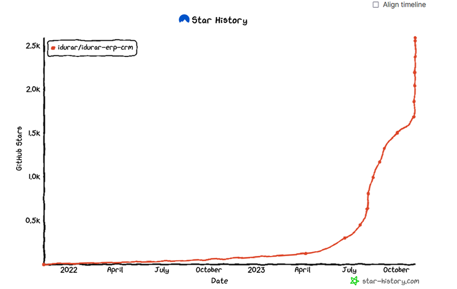

<div align="center">
    <a href="https://www.idurarapp.com/">
  
    </a>
    <h1>Free Open Source ERP / CRM | Node.js React.js</h1>
    <p align="center">
        <p>IDURAR ERP CRM | Simple To Use </p>
    </p>
    
  [www.idurarapp.com/open-source-erp-crm/](https://www.idurarapp.com/open-source-erp-crm/)

IDURAR is Open Source ERP / CRM (Invoice / Inventory / Accounting / HR) Based on Advanced Mern Stack (Node.js / Express.js / MongoDb / React.js ) with Ant Design (AntD) and Redux

</div>

**Live App Demo** : [https://idurarapp.com/demo/](https://idurarapp.com/demo/)

```
🚀 Give a Star ⭐️ & Fork to this project ... Happy coding! 🤩
```

## Our Sponsors

  <a href="https://m.do.co/c/4ead8370b905?ref=idurarapp.com">
    
  </a>

#


## Open Source ERP / CRM App

IDURAR is Open Source ERP / CRM (Invoice / Inventory / Accounting / HR) Based on Mern Stack (Node.js / Express.js / MongoDb / React.js ) with Ant Design (AntD) and Redux

**Live App Demo** : [https://idurarapp.com/demo/](https://idurarapp.com/demo/)

`username : admin@demo.com password : admin123`

## Getting started

#### Step 1: Clone the repository

```bash
git clone https://github.com/idurar/idurar-erp-crm.git
```

```bash
cd idurar-erp-crm
```

#### Step 2: Create Your MongoDB Account and Database/Cluster

- Create your own MongoDB account by visiting the MongoDB website and signing up for a new account.

- Create a new database or cluster by following the instructions provided in the MongoDB documentation. Remember to note down the "Connect to your application URI" for the database, as you will need it later. Also, make sure to change `<password>` with your own password

- add your current IP address to the MongoDB database's IP whitelist to allow connections (this is needed whenever your ip changes)

#### Step 3: Create the Environment File

- Create a file named .variables.env in the root directory.
- Copy all variables from tmp.variables.env .
- Paste the copied variables inside .variables.env.
  This file will store environment variables for the project to run.

#### Step 4: Update MongoDB URI

In the .variables.env file, find the line that reads:

`DATABASE="your-mongodb-uri"`

Replace "your-mongodb-uri" with the actual URI of your MongoDB database.

#### Step 5: Install Backend Dependencies

In your terminal, navigate to the root directory of the project and run the following command to install the backend dependencies:

```bash
npm install
```

This command will install all the required packages specified in the package.json file.

#### Step 6: Run Setup Script

While still in the root directory of the project, execute the following command to run the setup script:

```bash
node setup/setup.js
```

This setup script may perform necessary database migrations or any other initialization tasks required for the project.

#### Step 7: Run the Backend Server

In the same terminal, run the following command to start the backend server:

```bash
npm run dev
```

This command will start the backend server, and it will listen for incoming requests.

#### Step 8: Install Frontend Dependencies

Open a new terminal window , and run the following command to install the frontend dependencies:

```bash
cd frontend
```

```bash
npm install
```

This command will navigate to the frontend directory within the project and install all the required packages for the frontend.

#### Step 9: Run the Frontend Server

After installing the frontend dependencies, run the following command in the same terminal to start the frontend server:

```bash
npm run start
```

This command will start the frontend server, and you'll be able to access the website on localhost:3000 in your web browser.

:exclamation: :warning:` If you encounter an OpenSSL error while running the frontend server, follow these additional steps:`

Reason behind error: This is caused by the node.js V17 compatible issues with OpenSSL, see [this](https://github.com/nodejs/node/issues/40547) and [this](https://github.com/webpack/webpack/issues/14532) issue on GitHub.

Try one of these and error will be solved

- > Downgrade to Node.js v16.

- > Enable legacy OpenSSL provider

Here is how you can enable legacy OpenSSL provider

- On Unix-like (Linux, macOS, Git bash, etc.)

```bash
export NODE_OPTIONS=--openssl-legacy-provider
```

- On Windows command prompt:

```bash
set NODE_OPTIONS=--openssl-legacy-provider
```

- On PowerShell:

```bash
$env:NODE_OPTIONS = "--openssl-legacy-provider"
```

Here is [reference](https://github.com/webpack/webpack/issues/14532#issuecomment-947012063) about enabling legacy OpenSSL provider

After trying above solutions, run below command

```bash
npm run start
```

> If you still facing issue, then follow [this stackoverflow thread](https://stackoverflow.com/questions/69692842/error-message-error0308010cdigital-envelope-routinesunsupported). It has so many different types of opinions. You definitely have solution after going through the thread.

### Website Login Credentials

Once the website is up and running, you can log in using the following credentials:

`username : admin@demo.com - password : admin123`

Now you should be all set to run the project locally on your machine and explore its features.

## Contributing

1.[How to contribute](https://github.com/idurar/idurar-erp-crm/blob/master/CONTRIBUTING.md#how-to-contribute)

2.[Reporting issues](https://github.com/idurar/idurar-erp-crm/blob/master/CONTRIBUTING.md#reporting-issues)

3.[Working on issues ](https://github.com/idurar/idurar-erp-crm/blob/master/CONTRIBUTING.md#working-on-issues)

4.[Submitting pull requests](https://github.com/idurar/idurar-erp-crm/blob/master/CONTRIBUTING.md#submitting-pull-requests)

5.[Commit Guidelines](https://github.com/idurar/idurar-erp-crm/blob/master/CONTRIBUTING.md#commit-guidelines)

6.[Coding Guidelines](https://github.com/idurar/idurar-erp-crm/blob/master/CONTRIBUTING.md#coding-guidelines)

7.[Questions](https://github.com/idurar/idurar-erp-crm/blob/master/CONTRIBUTING.md#questions)

## Star History

Here you can see the proxy of our growth on the platform and that we're only getting started.

But if you'd like to check it out more news and website you can always check it out on: https://www.idurarapp.com/.

[](https://star-history.com/#idurar/idurar-erp-crm)

## License

MIT/Massachusetts Institute of Technology(here [LICENSE](https://github.com/idurar/idurar-erp-crm/blob/master/LICENSE))

The IDURAR code is licensed by Massachusetts Institute of Technology.

By contributing to IDURAR, you will be agreeing that your contributions will be licensed under its Massachusetts Institute of Technology(MIT).

## Show your support

Dont forget to give a ⭐️ to this project ... Happy coding!
